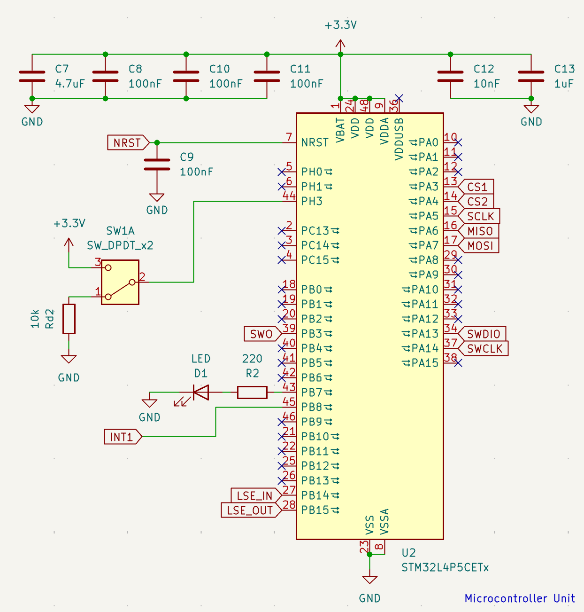
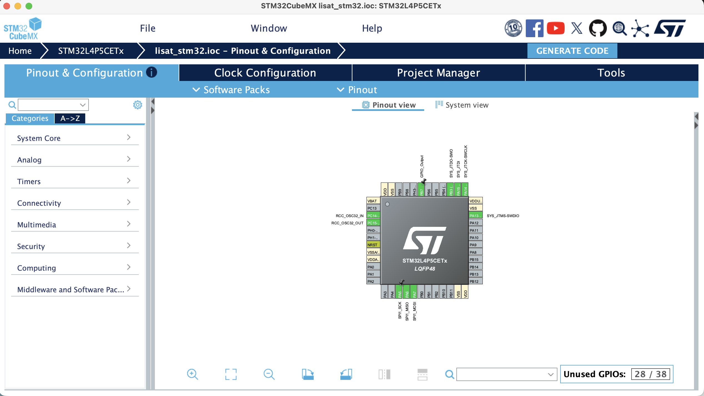
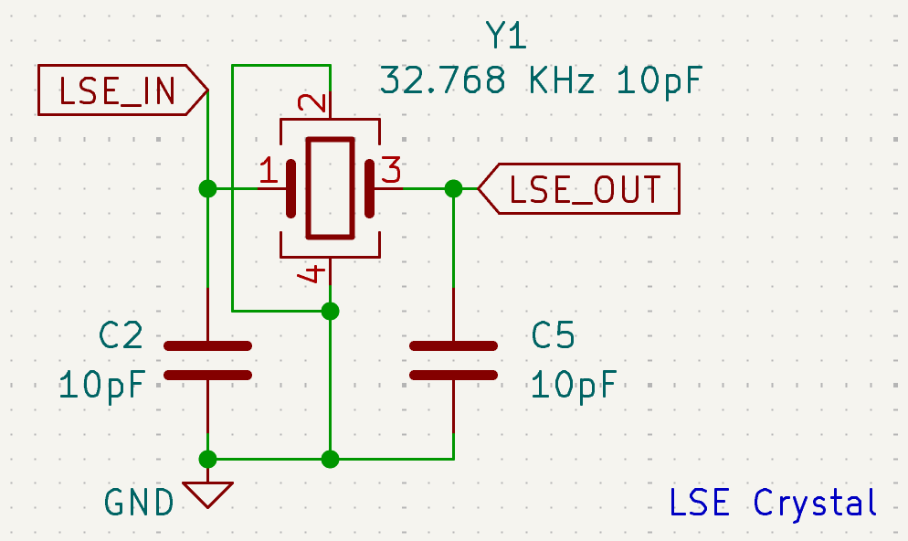
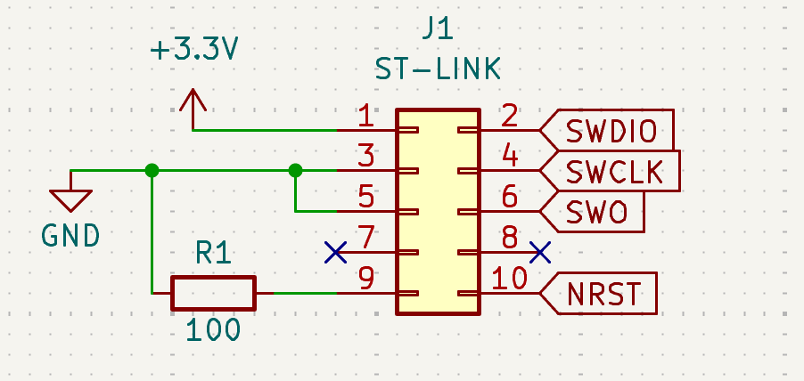
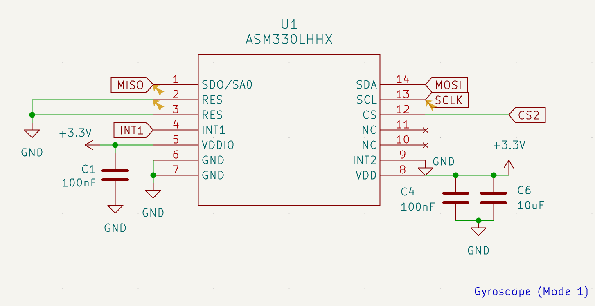
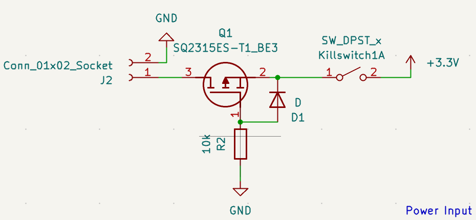
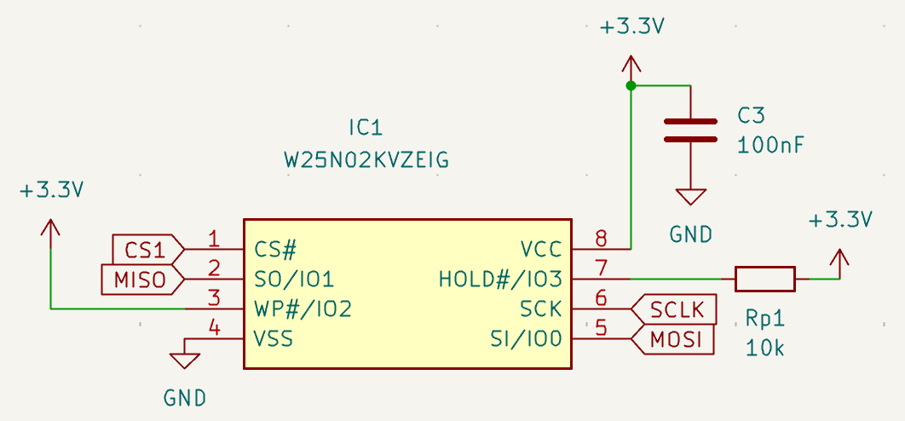
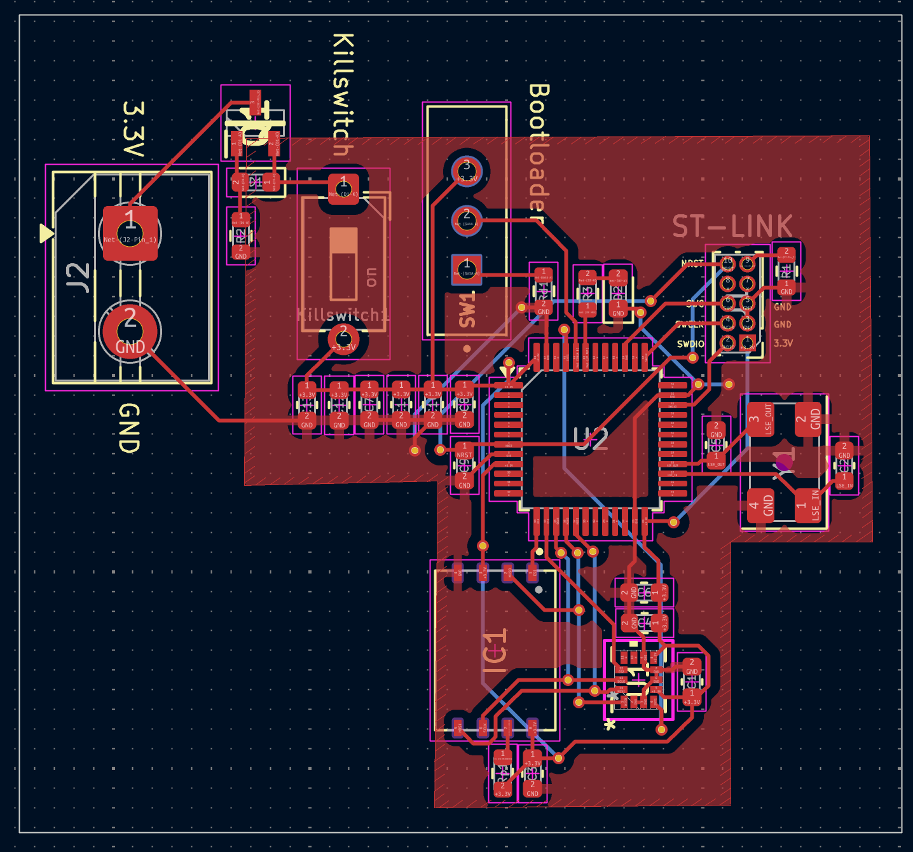
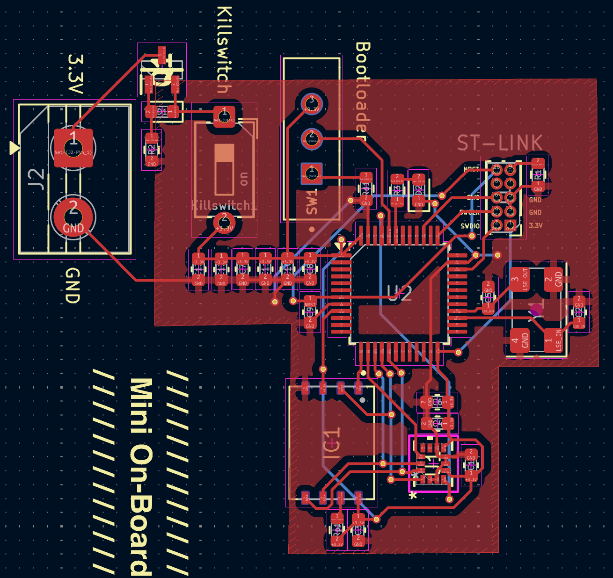
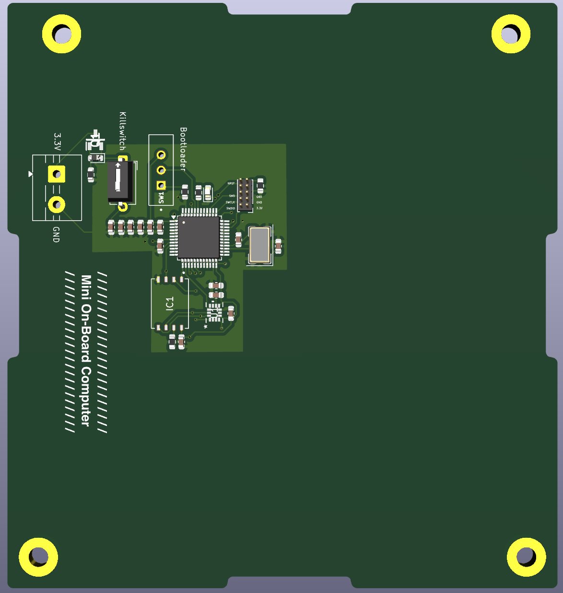

# Mini-OBC

**Author:** Xavier Minorsa  
**Tool:** KiCad 9.0.6

Copyright 2026 Xavier Minorsa
SPDX-License-Identifier: CERN-OHL-S-2.0

---

This README details the hardware design choices and development of the Mini On-Board Computer. The objective is to design a reliable, low-power Mini-OBC that includes a MCU, memory module, gyroscope, etc.

The philosophy adopted for this Mini-OBC project highly focuses on power-efficiency, by selecting low-power components like an MCU from the STM32L family.

---

## Table of Contents

- [Glossary](#glossary)
- [Choosing an MCU](#choosing-an-mcu)
- [Choosing a Storage Module](#choosing-a-storage-module)
- [Assembly & Schematics](#assembly--schematics)
  - [MCU](#mcu)
  - [LSE Crystal](#lse-crystal)
  - [ST-LINK V2 Connector](#st-link-v2-connector)
  - [Gyroscope ASM330LHHX](#gyroscope-asm330lhhx)
  - [Power Input](#power-input)
  - [NAND Flash Memory Module](#nand-flash-memory-module)
- [PCB & 3D Renders](#pcb--3d-renders)
- [References](#references)

---

## Glossary

| Acronym | Definition |
|---------|------------|
| CS | Chip Select |
| DRC | Design Rule Check |
| ECC | Error Correction Code |
| FPU | Floating-Point Unit |
| GPIO | General-Purpose Input/Output |
| I²C | Inter-Integrated Circuit |
| I/O | Input/Output |
| JTAG | Joint Test Action Group |
| LSE | Low-Speed External |
| MCU | Microcontroller Unit |
| MOSFET | Metal-Oxide-Semiconductor Field-Effect Transistor |
| NAND | Not AND (Flash Memory) |
| NOR | Not OR (Flash Memory) |
| NRST | System Reset (Active Low) |
| OBC | On-Board Computer |
| PCB | Printed Circuit Board |
| RAM | Random-Access Memory |
| RTC | Real-Time Clock |
| RTOS | Real-Time Operating System |
| SMPS | Switched-Mode Power Supply |
| SPI | Serial Peripheral Interface |
| SRAM | Static Random-Access Memory |
| SWCLK | Serial Wire Clock |
| SWD | Serial Wire Debug |
| SWDIO | Serial Wire Data Input/Output |
| UART | Universal Asynchronous Receiver-Transmitter |
| USART | Universal Synchronous/Asynchronous Receiver-Transmitter |
| VCC | Voltage Common Collector |

---

## Choosing an MCU

Choosing the right MCU consists in considering the limited resources and the rough environment that the satellite will operate in. The following selection was based on a hierarchy of requirements:

- **Power efficiency:** Power efficiency is arguably the most critical parameter. The MCU must offer the lowest possible power consumption in Run mode and low-power modes to save battery life during orbital eclipses.
- **Memory management:** Memory management must provide sufficient capacity to host the chosen RTOS, flight software, and data buffers. And at the same time utilizing the internal SRAM to avoid the need for external RAM chips for this project alone (however, in a real CubeSat mission, it is strongly recommended to include an external RAM chip).
- **Processing Capability**
- **Number of GPIO ports and Communication interfaces included**

My first choice was initially the STM32F401, it has been used in CubeSat projects before [[1]](#references), therefore a solid candidate. However, since 64 KB won't be enough to run RTOS entirely in the MCU's SRAM, 64 KB of SRAM is very limited for such task. With that obstacle in mind, I meticulously searched the STMicroelectronics' catalog, while prioritizing low-power and high SRAM density. This process along with another CubeSat project I found that used a low-power MCU [[2]](#references), resulted in the selection of the superior STM32L4P5, an STM32L is slightly more powerful and power efficient variant.

### MCU Comparative Analysis

| Feature | STM32L4P5 (Selected) [[3]](#references) | STM32L496 (Candidate B) [[4]](#references) | STM32F401 (Baseline) [[5]](#references) |
|---------|----------------------------------------|-------------------------------------------|----------------------------------------|
| Architecture Focus | Ultra-Low-Power & Performance | Ultra-Low-Power | Dynamic Efficiency (Standard) |
| Core | Arm® Cortex®-M4 + FPU | Arm® Cortex®-M4 + FPU | Arm® Cortex®-M4 + FPU |
| Max Frequency | 120 MHz | 80 MHz | 84 MHz |
| Flash Memory | Up to 1 MB | Up to 1 MB | Up to 256 KB |
| Internal SRAM | 320 KB | 320 KB | 64 KB |
| Active Consumption (Run) | 41 µA/MHz (SMPS mode) | 37 µA/MHz (SMPS mode) | 128 µA/MHz |
| Sleep Consumption | 42 nA (Standby mode) | 108 nA (Standby mode) | 42 µA (Stop mode) |
| Max GPIOs (I/O) | Up to 136 (depends on package) | Up to 136 (depends on package) | Up to 81 (depends on package) |
| SPI Interfaces | 3 | 3 | 4 |
| UART/USART Interfaces | 6 (5x USART + 1x LPUART) | 6 (5x USART + 1x LPUART) | 3 |
| I2C Interfaces | 4 | 4 | 3 |

In this decision, the STM32F401 was initially discarded. Even though it is low cost, its limiting SRAM (64 KB) prevented the adoption of our Integrated Architecture, which would require an external RAM. The true trade-off starts when focusing on the ultra-low-power MCUs, the STM32L496 that was already used in a CubeSat project, and the STM32L4P5. Both having 320 KB of SRAM, great for isolating the FreeRTOS. However, the STM32L4P5 was selected because it offers a vastly superior performance over the STM32L496.

---

## Choosing a Storage Module

The storage module should act like a CubeSat's secondary "hard drive" responsible to store the log data related to critical telemetry, orbital altitude, etc. The following selection was based on a hierarchy of requirements:

- **Power Efficiency**
- **Storage capability**
- **Endurance and Reliability**
- **Serial communication interface used**

It was selected two industry-standard 2Gb SPI NAND Flash modules: the Winbond W25N02KV and the Micron MT29F2G01AB (that has been used in a CubeSat mission [[6]](#references)), both sharing an identical physical footprint (8x6 mm, 8-pins).

The reason NAND flash memory was selected for this project is because NAND Flashes offer high storage density, are non-volatile, writing/erasing speeds are very fast, and they are incredibly durable. Other flash memories like SD Card were considered, which offer way more flexibility, but they require a mechanical connector — in a space environment, intense vibrations can happen any time, which can cause mechanical contact failures. On the other hand, NOR flash memories are a good contender as they offer fast read speeds, but NAND is faster in erasing data and offers higher density of storage.

### NAND Flash Comparative Analysis

| Parameter | Winbond W25N02KV (Selected) [[7]](#references) | Micron MT29F2G01AB (Baseline) [[8]](#references) |
|-----------|-----------------------------------------------|--------------------------------------------------|
| Capacity & Voltage | 2Gb (256 MB) / 2.7V to 3.6V | 2Gb (256 MB) / 2.7V to 3.6V |
| Clock Speed (SPI) | 104 MHz | 133 MHz |
| Erase Cycles (Endurance) | 100,000 cycles | 100,000 cycles |
| Sleep Consumption | 1 µA (Deep Power-Down) | ~10 to 50 µA (Standard Standby) |
| Active Read Current | 25 mA | 25 mA |
| Error Correction (ECC) | Internal (8-bit) | Internal (8-bit) |

Overall both memory modules are very capable and similar in terms of performance and even form factor (sharing the same footprint). In this decision, the Winbond W25N02KV was selected as the secondary storage module for the OBC due to sharing similar performance — despite the W25N02KV's clock speed being slightly inferior to the MT29F2G01AB, its superior sleep consumption highly overlaps the small inconvenience of having less clock speed.

---

## Assembly & Schematics

### MCU

A decoupling capacitor was added for each power port the MCU has, plus a 4.7 µF decoupler required by the datasheet. A switch was also added in the boot line to enable/disable boot mode.

STM32CubeMX was used to help check and assign the correct pins for each connection. Although this could be done by checking the datasheet, the STM32CubeMX gives a practical overview that allows you to interact with each pin and check what each pin does.

---

### LSE Crystal

An LSE (Low-Speed External) Crystal was implemented to act as an external RTC for the OBC to provide an accurate, low-power clock source and timing functions. Although the MCU has an inbuilt RTC, the usage of an external RTC increases its reliability. The standard frequency is 32.768 kHz because it has a power of 2 (2¹⁵), allowing for easy division down to 1 Hz.

In order to calculate the capacitance of each capacitor, the following equation was used:

$$C_1 = C_2 = 2 \times (C_{\text{crystal}} - C_{\text{stray}})$$

Where $C_{\text{stray}}$ (stray capacitance) is typically 3 pF to 5 pF.

---

### ST-LINK V2 Connector

A header for ST-LINK V2 with Serial Wire Debug (SWD) interface was added to allow upload and real-time debugging between the MCU and the debugging device.

The board features a 10-pin header that provides the necessary connections. The pinout is compatible with standard ST-Link V2 and V3 programmers:

| Pin | Signal | Description |
|-----|--------|-------------|
| 1 | VCC (3.3V) | Power supply |
| 2 | SWDIO | Serial Wire Data I/O — bi-directional data line for communication between debugger and MCU |
| 3, 5, 9 | GND | Ground |
| 4 | SWCLK | Serial Wire Clock — driven by the ST-Link to synchronize data transfer |
| 10 | NRST | System Reset (Active Low) — allows the programmer to perform a hardware reset of the MCU |

The benefits of using the SWD protocol instead of JTAG are the reduced amount of necessary pins, simplified routing and the full debug capability — it allows full access to memory, registers, etc.

---

### Gyroscope ASM330LHHX

The ASM330LHHX was recommended for this project due to its reliability under high thermal conditions and resilience to vibrations. The gyroscope supports both I²C and SPI protocols, however it was configured to operate via SPI due to its superior transmission speed, reduced latency and signal integrity robustness. Mode 1 was adopted because additional external sensors weren't used to justify the usage of Mode 2. Decoupling capacitors were applied for each power source, following its datasheet's recommendation.

---

### Power Input

A power supply can be connected through J2, a 2-pin header supplying 3.3V and ground. Previously an inline diode reverse-polarity protection was considered; however, the forward voltage drops 0.7V when using this approach, violating minimum operating requirements of certain components. Therefore the inline diode was removed, and instead a P-Channel MOSFET [[9]](#references) was implemented to pass current with little loss of voltage. If the polarities connected are reversed, the MOSFET closes, blocking the reverse energy and preventing the board from burning — making it ideal for projects that prioritize power-saving.

---

### NAND Flash Memory Module

The memory module communicates with the MCU via SPI protocol. A pull-up resistor was added to the CS pin to prevent memory corruption from electrical noise. A single decoupler was added to the VCC pin as suggested by its datasheet.

---

## PCB & 3D Renders

---

## References

1. Ghatul, S., Chandra P., B., Jain, S., Nair, B. G., Babu, M., Mohan, R., Safonova, M., & Murthy, J. (2020). CubeOps: Development of an STM32 based on-board computer (OBC) for small satellites and CubeSat missions. In *Space Telescopes and Instrumentation 2020: Ultraviolet to Gamma Ray* (Vol. 11444, p. 1144476). SPIE.

2. RG SAT. (2020, July 5). *Building a CubeSat for less than $1000 — Part 3 — Avionics Schematic* [Video]. YouTube. https://www.youtube.com/watch?v=nSqU23qWrQA

3. STMicroelectronics. (2021). *STM32L4P5xx: Ultra-low-power Arm® Cortex®-M4 32-bit MCU+FPU, 150 DMIPS, up to 1-MB Flash memory, 320-KB SRAM, LCD-TFT, ext. SMPS* (DS12903 Rev 3).

4. STMicroelectronics. (2025). *STM32L496xx: Ultra-low-power Arm® Cortex®-M4 32-bit MCU+FPU, 100 DMIPS, up to 1 MB flash, 320 KB SRAM, USB OTG FS, audio, HASH, external SMPS* (DS11585 Rev 20).

5. STMicroelectronics. (2019). *STM32F401xB STM32F401xC: Arm® Cortex®-M4 32-bit MCU+FPU, 105 DMIPS, 256KB Flash / 64KB RAM, 11 TIMS, 1 ADC, 11 comm. interfaces* (DS9716 Rev 11).

6. Horbach, A. (2021). *Development of an on-board computer for a nanosatellite* [Master's thesis, University of Liège]. MatheO. http://hdl.handle.net/2268.2/11659

7. Winbond Electronics. (2021). *W25N02KVxxIR/U: 3V 2G-bit SLC QspiNAND Flash Memory with Dual/Quad SPI* (Rev. G).

8. Micron Technology. (2015). *2Gb 3.3V x1, x2, x4: SPI NAND Flash Memory* (Rev. F 09/16).

9. Afrotechmods. (2011, December 2). *How to protect circuits from reversed voltage polarity!* [Video]. YouTube. https://www.youtube.com/watch?v=IrB-FPcv1Dc
